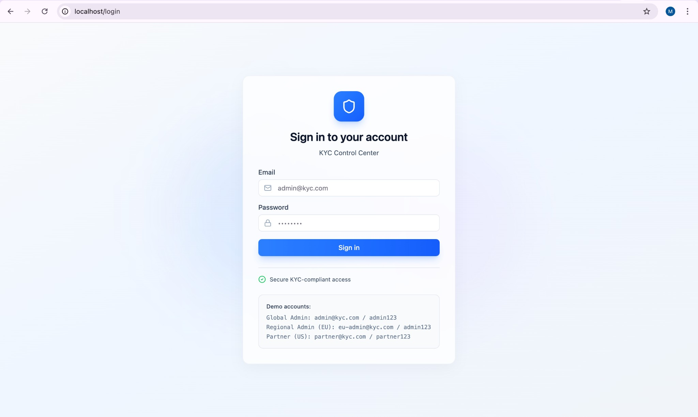
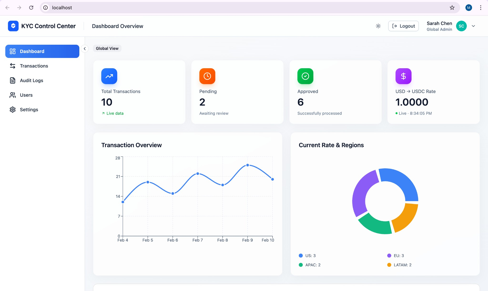
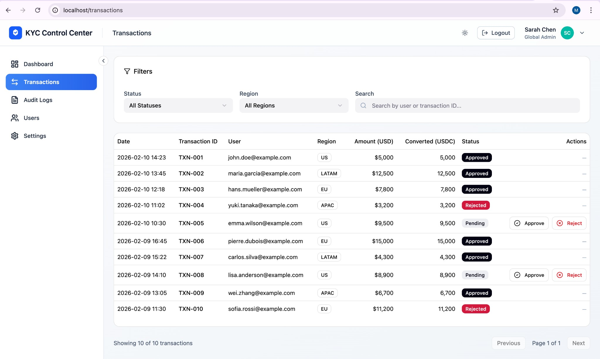
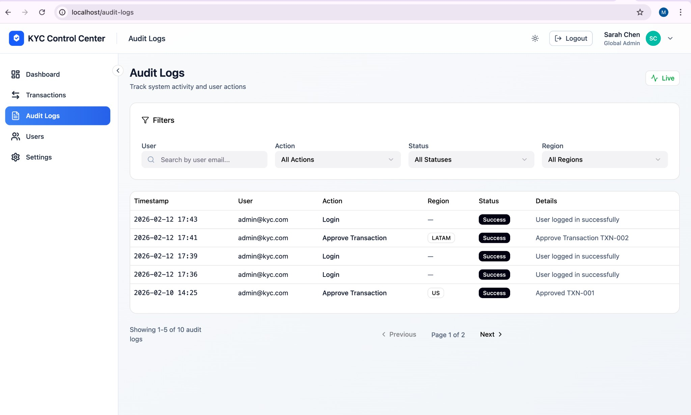
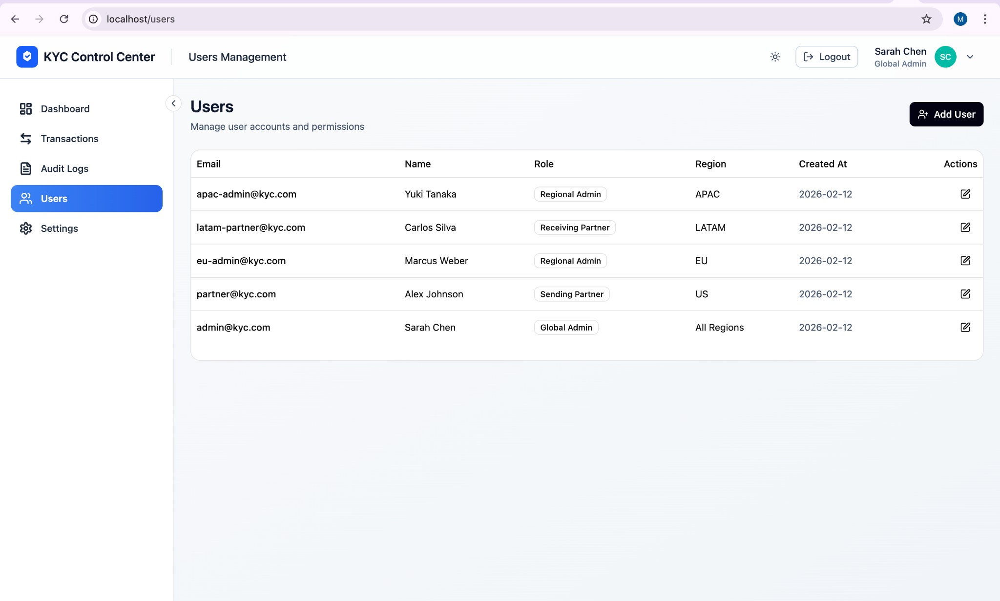
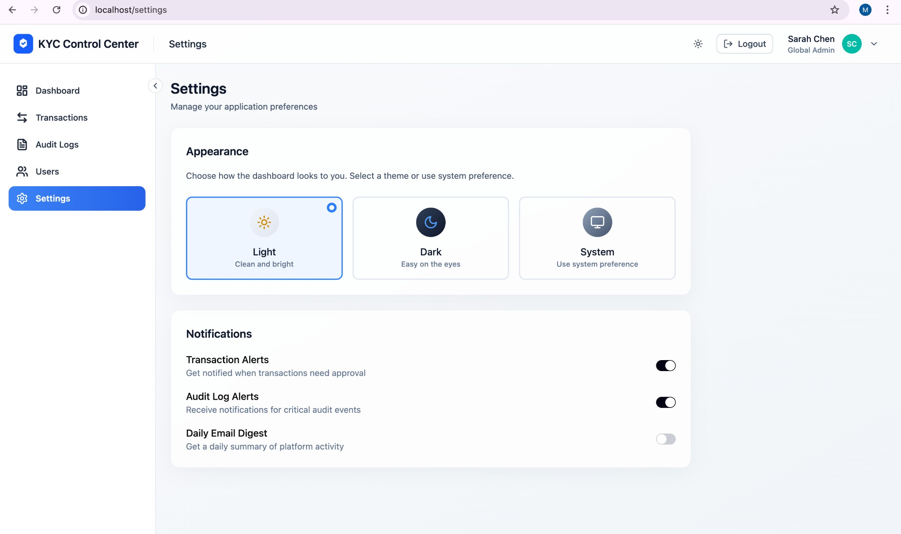

# Multi-Region KYC Admin Dashboard

> A production-grade, full-stack **MERN** application for managing Know Your Customer (KYC) workflows across multiple regions with real-time audit logging, role-based access control, and third-party API integration.



---

## Table of Contents

- [Overview](#overview)
- [Live Screenshots](#live-screenshots)
- [Architecture](#architecture)
- [Tech Stack](#tech-stack)
- [Features](#features)
- [Security & Compliance](#security--compliance)
- [Getting Started](#getting-started)
- [Docker Setup](#docker-setup)
- [API Reference](#api-reference)
- [Scaling Strategy for 10K+ Users](#scaling-strategy-for-10k-users)
- [Project Structure](#project-structure)
- [Test Credentials](#test-credentials)

---

## Overview

This dashboard enables financial compliance teams to:

- **Monitor cross-border transactions** across US, EU, APAC, and LATAM regions
- **Approve or reject KYC transactions** with full audit trail
- **Track real-time USD → USDC conversion rates** via Cybrid API integration
- **Manage users and roles** with granular, region-based permissions
- **Search and filter audit logs** for regulatory compliance

Built as a fintech-grade solution following PCI-DSS security principles and designed to scale to 10,000+ concurrent users.

---

## Live Screenshots

### Dashboard — Global Admin View
Real-time transaction stats, conversion rates, trend charts, and regional distribution.



### Transactions — Filterable Table with Approve/Reject Actions
Filter by status, region, or search. Admins can approve or reject pending transactions.



### Audit Logs — Real-Time Activity Stream
Every user action is logged. Filter by user, action type, status, or region.



### Users Management — RBAC Overview
Global Admins can view and manage all users across roles and regions.



### Settings — Theme & Preferences
Switch between Light, Dark (blue-slate), and System themes.



---

## Architecture

```
┌────────────────────────────────────────────────────────────────────┐
│                        Client (Browser)                            │
│  React 18 · Vite · Tailwind CSS · React Router · Recharts         │
└────────────────────┬───────────────────────────────────────────────┘
                     │  HTTP / REST (JWT Bearer Token)
                     ▼
┌────────────────────────────────────────────────────────────────────┐
│                    Backend API (Node.js / Express)                  │
│                                                                    │
│  ┌──────────┐  ┌──────────┐  ┌───────────┐  ┌──────────────────┐  │
│  │ Auth     │  │ RBAC     │  │ Rate      │  │ Audit Logging    │  │
│  │ (JWT)    │  │ Middleware│  │ Limiter   │  │ Service          │  │
│  └────┬─────┘  └────┬─────┘  └─────┬─────┘  └────────┬─────────┘  │
│       │              │              │                  │            │
│  ┌────┴──────────────┴──────────────┴──────────────────┴─────────┐ │
│  │              Controllers / Services                            │ │
│  │  Transactions · Users · Audit Logs · Cybrid Rates              │ │
│  └────────────────────────────────────┬──────────────────────────┘ │
│                                       │                            │
│  ┌────────────────────────────────────┴──────────────────────────┐ │
│  │  In-Memory Cache (Redis-like)  ·  Cybrid Token Manager        │ │
│  └───────────────────────────────────────────────────────────────┘ │
└────────────────────┬───────────────────────┬───────────────────────┘
                     │                       │
                     ▼                       ▼
         ┌───────────────────┐    ┌────────────────────┐
         │  MongoDB Atlas    │    │  Cybrid API (Mock)  │
         │  ┌─────────────┐  │    │  GET /rates         │
         │  │ users       │  │    │  ?from=USD&to=USDC  │
         │  │ transactions│  │    │  → { rate: 1.0 }    │
         │  │ audit_logs  │  │    └────────────────────┘
         │  └─────────────┘  │
         └───────────────────┘
```

### Request Flow

1. User logs in → backend verifies credentials → returns signed **JWT**
2. Frontend stores JWT and sends it on every request via `Authorization: Bearer <token>`
3. Backend **RBAC middleware** checks user role and region before processing
4. Every significant action triggers an **audit log entry** (append-only)
5. Cybrid conversion rates are fetched and **cached in-memory** (60s TTL) to reduce API calls

---

## Tech Stack

| Layer           | Technology                                                  |
| --------------- | ----------------------------------------------------------- |
| **Frontend**    | React 18, Vite 6, TypeScript, Tailwind CSS 4, Recharts     |
| **Backend**     | Node.js, Express.js, JWT, bcryptjs                         |
| **Database**    | MongoDB (Mongoose ODM), MongoDB Atlas                      |
| **3rd Party**   | Cybrid API (mock via Beeceptor) for USD/USDC rates         |
| **DevOps**      | Docker, Docker Compose, Nginx                              |
| **Security**    | JWT auth, RBAC middleware, rate limiting, CORS, bcrypt      |

---

## Features

### Authentication & Authorization
- **JWT-based authentication** — stateless, secure token-based sessions
- **4-tier RBAC** — Global Admin, Regional Admin, Sending Partner, Receiving Partner
- **Region-locked access** — Regional Admins and Partners only see their assigned region
- **Token verification on mount** — automatic session validation on page load

### Transaction Management
- View all transactions with real-time data from MongoDB
- **Filter by status** (Pending, Approved, Rejected) and **region** (US, EU, APAC, LATAM)
- **Search** by user email or transaction ID
- **Approve/Reject** actions for admin roles with instant audit log creation
- Pagination with server-side query support

### Audit Logging
- **Append-only** audit log — entries can never be modified or deleted
- Logs every action: logins, transaction approvals, user management, rate fetches
- **Real-time filtering** by user, action type, status, and region
- Schema: `{ userId, userEmail, action, status, details, region, timestamp, ipAddress }`

### Cybrid API Integration
- Backend proxies `GET /api/rates?from=USD&to=USDC` to Cybrid (or mock)
- **In-memory caching** with 60-second TTL (Redis-like pattern)
- Automatic fallback to mock data if API is unreachable
- Frontend polls every 15 seconds with a "Live" indicator

### Dashboard & UI
- **Real-time stats** — total transactions, pending count, approved count, live rate
- **Transaction trend chart** (7-day line chart via Recharts)
- **Regional distribution** (pie/donut chart)
- **Three themes** — Light, Dark (blue-slate), System — switchable from header or settings
- **Responsive sidebar** — collapsible with clear active states
- **Glass-card design** with modern, accessible UI

---

## Security & Compliance

### PCI-DSS Compliance Approach

This application follows PCI-DSS security principles applicable to a KYC dashboard:

| Requirement | Implementation |
| --- | --- |
| **Secure authentication** | Passwords hashed with bcrypt (10 rounds). JWT tokens with expiration. No plaintext credentials stored. |
| **Access control** | Role-based middleware enforces least-privilege access. Region-locked queries prevent unauthorized data exposure. |
| **Audit trail** | Append-only audit log captures every user action with timestamps, IP addresses, and user agents. Entries cannot be modified or deleted. |
| **Network security** | CORS restricted to allowed origins. Rate limiting (100 req/15min) prevents brute force. HTTPS recommended for production. |
| **Data protection** | Environment variables for secrets (never committed). `.env` files excluded via `.gitignore`. Sensitive fields excluded from API responses. |
| **Monitoring** | Comprehensive audit logs enable anomaly detection. Structured logging for all API operations. |

### Security Measures Implemented

- **bcryptjs** — 10-round salt for password hashing
- **JWT tokens** — signed with a 256-bit secret, 24h expiration
- **Rate limiting** — 100 requests per 15 minutes per IP
- **CORS** — whitelist-only cross-origin policy
- **Input validation** — all API inputs validated before processing
- **Error sanitization** — internal errors never exposed to clients
- **Helmet-ready** — headers hardened for production deployment

---

## Getting Started

### Prerequisites

- Node.js 18+
- MongoDB Atlas account (or local MongoDB)
- npm 9+

### 1. Clone the repository

```bash
git clone https://github.com/mirnabadr/KYC-Admin-Dashboard.git
cd KYC-Admin-Dashboard
```

### 2. Configure environment variables

**Backend** (`backend/.env`):
```env
MONGODB_URI=mongodb+srv://<user>:<password>@cluster0.xxxxx.mongodb.net/kyc_admin
JWT_SECRET=your-256-bit-secret
PORT=3001
CORS_ORIGIN=http://localhost:5173
CYBRID_API_URL=https://your-mock.free.beeceptor.com
CYBRID_API_KEY=your-client-id
CYBRID_API_SECRET=your-client-secret
```

**Frontend** (`frontend/.env`):
```env
VITE_API_URL=http://localhost:3001
```

### 3. Install dependencies

```bash
# Backend
cd backend && npm install

# Frontend
cd ../frontend && npm install
```

### 4. Seed the database

```bash
cd backend && npm run seed
```

This creates 5 users (across all 4 roles) and 10 sample transactions.

### 5. Start the application

```bash
# Terminal 1 — Backend (port 3001)
cd backend && npm run dev

# Terminal 2 — Frontend (port 5173)
cd frontend && npm run dev
```

Open **http://localhost:5173** in your browser.

---

## Docker Setup

Run the entire stack with a single command:

```bash
docker compose up --build
```

This starts:
- **MongoDB** on port 27017 (with health checks)
- **Backend API** on port 3001 (auto-seeds on first run)
- **Frontend** on port 80 (served via Nginx)

Open **http://localhost** to access the dashboard.

To stop:
```bash
docker compose down
```

---

## API Reference

All authenticated endpoints require `Authorization: Bearer <token>` header.

| Method | Endpoint | Access | Description |
| --- | --- | --- | --- |
| `POST` | `/api/auth/login` | Public | Login and receive JWT |
| `GET` | `/api/auth/me` | Authenticated | Get current user profile |
| `GET` | `/api/rates` | Authenticated | Get USD/USDC conversion rate |
| `GET` | `/api/transactions` | Authenticated | List transactions (filtered by role/region) |
| `GET` | `/api/transactions/:id` | Authenticated | Get single transaction |
| `GET` | `/api/transactions/:id/status` | Authenticated | Get transaction status |
| `PATCH` | `/api/transactions/:id/status` | Admin | Approve or reject a transaction |
| `GET` | `/api/audit-logs` | Admin | List audit logs with filters |
| `GET` | `/api/users` | Global Admin | List all users |
| `POST` | `/api/users` | Global Admin | Create a new user |
| `PATCH` | `/api/users/:id` | Global Admin | Update user role/region |
| `GET` | `/health` | Public | Health check endpoint |

### Query Parameters

**Transactions**: `?status=Pending&region=EU&search=john&page=1&limit=10`

**Audit Logs**: `?action=Login&status=Success&region=US&userEmail=admin@kyc.com&page=1&limit=5`

---

## Scaling Strategy for 10K+ Users

### Database Layer
- **MongoDB Atlas** with replica sets for high availability
- **Compound indexes** on frequently queried fields (`region + status`, `timestamp + action`)
- **Read replicas** for audit log queries (heavy read workload)
- **TTL indexes** on audit logs for automated data retention policies

### Application Layer
- **Horizontal scaling** — stateless JWT allows any backend instance to handle any request
- **Redis cluster** to replace in-memory cache for shared state across instances
- **Connection pooling** — Mongoose configured with `maxPoolSize` for efficient DB connections
- **Worker threads** for CPU-intensive operations (report generation, bulk exports)

### Infrastructure
- **Kubernetes** orchestration with auto-scaling based on CPU/memory
- **Nginx load balancer** with sticky sessions disabled (stateless API)
- **CDN** for frontend static assets (Vite build output)
- **Rate limiting** scaled per-user with Redis-backed sliding window

### Monitoring & Observability
- Structured JSON logging compatible with ELK stack
- Health check endpoints for load balancer probes
- Audit log analytics for compliance reporting dashboards

---

## Project Structure

```
KYC-Admin-Dashboard/
├── frontend/                    # React SPA (Vite + TypeScript + Tailwind)
│   ├── src/
│   │   ├── app/
│   │   │   ├── components/      # Reusable UI components
│   │   │   ├── context/         # Auth & Theme contexts
│   │   │   ├── pages/           # Route pages (Dashboard, Transactions, etc.)
│   │   │   └── services/        # API client with JWT handling
│   │   └── styles/              # Theme CSS variables
│   ├── Dockerfile               # Multi-stage build → Nginx
│   └── nginx.conf               # Production Nginx config
│
├── backend/                     # Node.js / Express API
│   ├── src/
│   │   ├── controllers/         # Route handlers
│   │   ├── middleware/           # Auth, RBAC, error handling, rate limiting
│   │   ├── models/              # Mongoose schemas (User, Transaction, AuditLog)
│   │   ├── routes/              # Express route definitions
│   │   ├── services/            # Cybrid API, cache, audit logging
│   │   ├── scripts/             # Database seeding
│   │   └── config/              # Database connection config
│   └── Dockerfile               # Node.js production image
│
├── screenshots/                 # Application screenshots
├── docker-compose.yml           # Full stack: MongoDB + Backend + Frontend
└── .gitignore
```

---

## Test Credentials

| Role | Email | Password |
| --- | --- | --- |
| **Global Admin** | `admin@kyc.com` | `admin123` |
| **Regional Admin (EU)** | `eu-admin@kyc.com` | `admin123` |
| **Regional Admin (APAC)** | `apac-admin@kyc.com` | `admin123` |
| **Sending Partner (US)** | `partner@kyc.com` | `partner123` |
| **Receiving Partner (LATAM)** | `latam-partner@kyc.com` | `partner123` |

---

## License

This project was built as a technical assessment for a fintech engineering role. All code is original.

---

*Built with precision for compliance-grade fintech operations.*
